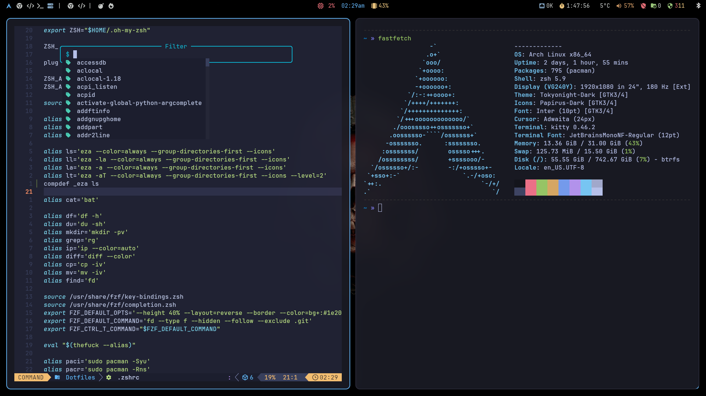

# Dotfiles

Arch Linux · i3 · kitty · polybar · picom · dunst · rofi · yazi



---

## Stack

| Component     | Tool                                                                                       |
| :------------ | :----------------------------------------------------------------------------------------- |
| WM            | [i3-wm](https://i3wm.org/)                                                                 |
| Terminal      | [kitty](https://sw.kovidgoyal.net/kitty/)                                                  |
| Bar           | [polybar](https://github.com/polybar/polybar)                                              |
| Compositor    | [picom](https://github.com/yshui/picom)                                                    |
| Notifications | [dunst](https://dunst-project.org/)                                                        |
| Launcher      | [rofi](https://github.com/davatorium/rofi)                                                 |
| File manager  | [yazi](https://github.com/sxyazi/yazi) + [thunar](https://docs.xfce.org/xfce/thunar/start) |
| Shell         | [zsh](https://www.zsh.org/) + [oh-my-zsh](https://ohmyz.sh/)                               |
| Theme         | [Tokyo Night](https://github.com/enkia/tokyo-night-vscode-theme)                           |
| Font          | [JetBrainsMono Nerd Font](https://www.nerdfonts.com/font-downloads)                        |
| Lock screen   | [betterlockscreen](https://github.com/betterlockscreen/betterlockscreen)                   |
| Editor        | [neovim](https://neovim.io/)                                                               |
| Browser       | [Brave](https://brave.com/)                                                                |

---

## Quick install

```bash
git clone https://github.com/revudev/Dotfiles.git ~/Dotfiles
cd ~/Dotfiles
chmod +x install.sh
./install.sh
```

> See below for the full manual installation if you prefer to do it step by step.

---

## Manual installation

### 1. Install yay (AUR helper)

```bash
sudo pacman -S --needed git base-devel
git clone https://aur.archlinux.org/yay.git /tmp/yay
cd /tmp/yay && makepkg -si --noconfirm
```

### 2. Install base packages

```bash
sudo pacman -S --needed \
  i3-wm i3status i3blocks polybar picom dunst rofi kitty \
  yazi thunar thunar-volman tumbler \
  zsh zsh-autosuggestions zsh-syntax-highlighting zsh-completions \
  neovim feh maim flameshot xclip \
  ttf-jetbrains-mono-nerd ttf-nerd-fonts-symbols noto-fonts-emoji \
  lxappearance papirus-icon-theme gnome-themes-extra \
  btop bat eza fd fzf ripgrep jq yq zoxide \
  network-manager-applet networkmanager blueman \
  pipewire pipewire-pulse pipewire-alsa wireplumber \
  stow git curl wget \
  xorg-xrandr xorg-xmodmap xorg-xset xss-lock dex \
  lightdm lightdm-gtk-greeter
```

Install AUR packages:

```bash
yay -S --needed \
  brave-bin \
  visual-studio-code-bin \
  tokyonight-gtk-theme-git \
  betterlockscreen \
  i3lock-color
```

### 3. Clone the repo

```bash
git clone https://github.com/revudev/Dotfiles.git ~/Dotfiles
```

### 4. Install oh-my-zsh

```bash
sh -c "$(curl -fsSL https://raw.githubusercontent.com/ohmyzsh/ohmyzsh/master/tools/install.sh)" "" --unattended
```

Link zsh plugins:

```bash
ln -sf /usr/share/zsh/plugins/zsh-syntax-highlighting ~/.oh-my-zsh/custom/plugins/zsh-syntax-highlighting
ln -sf /usr/share/zsh/plugins/zsh-autosuggestions ~/.oh-my-zsh/custom/plugins/zsh-autosuggestions
```

### 5. Symlink configs with stow

```bash
cd ~/Dotfiles
stow i3 kitty polybar picom dunst rofi fontconfig betterlockscreen zsh gtk wallpaper autostart brave nvim
```

If stow reports conflicts (existing files), back them up first:

```bash
mv ~/.config/i3 ~/.config/i3.bak
mv ~/.zshrc ~/.zshrc.bak
```

Then run stow again.

### 6. Set wallpaper for lock screen

```bash
betterlockscreen -u ~/.config/wallpaper/wallpaper.png
```

### 7. Enable display manager

```bash
sudo systemctl enable lightdm
```

### 8. Set zsh as default shell

```bash
chsh -s $(which zsh)
```

---

## Machine-specific configuration

### Monitor name

Find your monitor name:

```bash
xrandr
```

Edit the last line of `~/.config/i3/config`:

```
exec_always --no-startup-id xrandr --output HDMI-1 --mode 1920x1080 --rate 180.00
```

Edit `~/.config/polybar/config.ini`:

```ini
[bar/top]
monitor = HDMI-1
```

Replace `HDMI-1` with your actual output name.

### Weather location

Create `~/.config/polybar/weather.conf`:

```bash
WEATHER_LAT=xx.xxxx
WEATHER_LON=x.xxxx
```

Defaults to Madrid if the file does not exist. Find your coordinates at [open-meteo.com](https://open-meteo.com).

### Intel iGPU (picom)

If you see tearing or crashes, edit `~/.config/picom/picom.conf`:

```
backend = "egl";
```

If problems persist, fall back to `xrender` and remove the blur block:

```
backend = "xrender";
```

### Optional hardware packages

```bash
# NVIDIA GPU
sudo pacman -S --needed - < ~/Dotfiles/packages/pkglist_nvidia.txt

# AMD CPU microcode
sudo pacman -S --needed - < ~/Dotfiles/packages/pkglist_amd.txt

# Btrfs filesystem (snapshots with snapper)
sudo pacman -S --needed - < ~/Dotfiles/packages/pkglist_btrfs.txt

# Razer peripherals (OpenRazer + Polychromatic)
yay -S --needed - < ~/Dotfiles/packages/aur_pkglist_razer.txt
```

---

## Fonts

### Check if fonts are installed

```bash
fc-list | grep -i "JetBrains"
```

If empty, the font is not installed.

### Install fonts

```bash
sudo pacman -S --needed ttf-jetbrains-mono-nerd ttf-nerd-fonts-symbols
```

### Refresh font cache

```bash
fc-cache -fv
```

Verify:

```bash
fc-list | grep -i "JetBrains"
```

Expected output: `/usr/share/fonts/TTF/JetBrainsMonoNerdFont-Regular.ttf: JetBrainsMono Nerd Font:style=Regular`

---

## Reload configs

| Component       | Command                                                        |
| :-------------- | :------------------------------------------------------------- |
| i3              | `mod4 + Shift + c`                                             |
| i3 full restart | `mod4 + Shift + r`                                             |
| polybar         | `~/.config/polybar/launch.sh`                                  |
| dunst           | `killall dunst && dunst &`                                     |
| picom           | `killall picom && picom --config ~/.config/picom/picom.conf &` |
| zsh             | `source ~/.zshrc`                                              |

---

## Dark theme

The setup uses Tokyo Night dark by default. If GTK apps appear with a light theme:

**Option A — terminal:**

```bash
gsettings set org.gnome.desktop.interface gtk-theme "Tokyonight-Dark-BL"
gsettings set org.gnome.desktop.interface color-scheme "prefer-dark"
```

**Option B — GUI:**

```bash
lxappearance
```

Select **Tokyonight-Dark-BL** and click Apply.

If the theme is not installed:

```bash
yay -S tokyonight-gtk-theme-git
```

---

## Guides

- [VPN setup (WireGuard + polybar module)](docs/vpn-setup.md)
- [Brave profile setup](docs/brave-setup.md)
- [Lid close behavior](docs/lid-setup.md)

---

## Structure

```
Dotfiles/
├── i3/               → ~/.config/i3/
├── kitty/            → ~/.config/kitty/
├── polybar/          → ~/.config/polybar/
├── picom/            → ~/.config/picom/
├── dunst/            → ~/.config/dunst/
├── rofi/             → ~/.config/rofi/
├── fontconfig/       → ~/.config/fontconfig/
├── betterlockscreen/ → ~/.config/betterlockscreen/
├── gtk/              → ~/.config/gtk-3.0/ + ~/.gtkrc-2.0
├── nvim/             → ~/.config/nvim/
├── zsh/              → ~/.zshrc
├── docs/
│   ├── preview.png
│   ├── brave-setup.md
│   ├── lid-setup.md
│   └── vpn-setup.md
├── packages/
│   ├── pkglist.txt           ← official packages (base)
│   ├── aur_pkglist.txt       ← AUR packages (base)
│   ├── pkglist_nvidia.txt    ← optional: NVIDIA GPU
│   ├── pkglist_amd.txt       ← optional: AMD CPU microcode
│   ├── pkglist_btrfs.txt     ← optional: Btrfs + snapper
│   └── aur_pkglist_razer.txt ← optional: Razer peripherals
├── install.sh
└── README.md
```

---

## Adding a new config

```bash
mkdir -p ~/Dotfiles/<name>/.config/<name>
mv ~/.config/<name>/* ~/Dotfiles/<name>/.config/<name>/
cd ~/Dotfiles && stow <name>
```

## Updating package lists

```bash
pacman -Qqen > ~/Dotfiles/packages/pkglist.txt
pacman -Qqem > ~/Dotfiles/packages/aur_pkglist.txt
```
